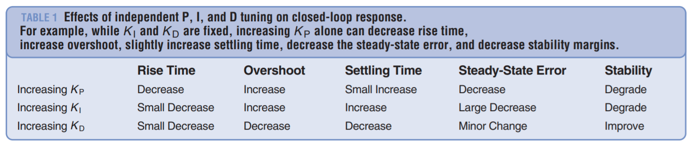
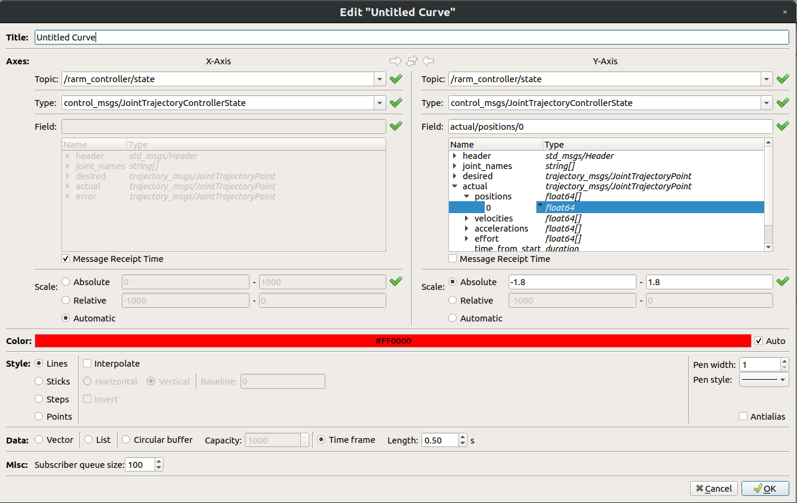
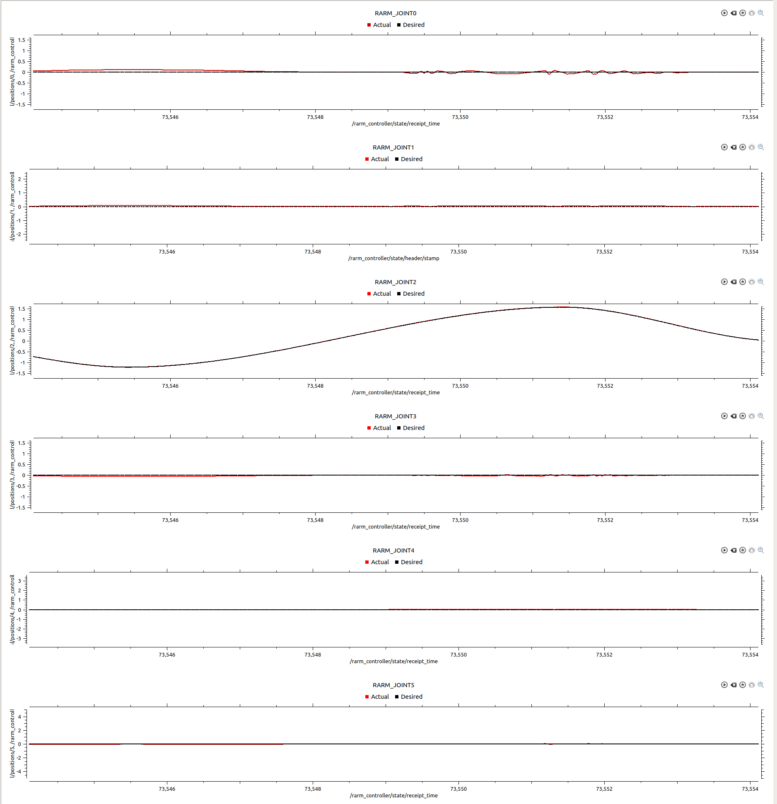

# nextage-PID-tuning

Discussion with Vlad:
 * Set integral to 0
 * Observe with RQT Multiplot
 * Configure with RQT Configure

## Progress Log
* 16/04 - Got Gazebo working on home PC, imported the Nextage model and setup workspace ready for tuning.
  * Issues with Nvidia drivers on home PC. Ensure installed with Additional Drivers in Ubuntu
  * Source everything `. devel/src`
  * Run Nextage model in Gazebo with: `roslaunch nextagea_gazebo nextagea_world.launch`
  * Make sure all dependencies are installed with: `rosdep install --from-paths ./ -iy`

* 17/04
  * Great videos on PID control: https://www.youtube.com/watch?v=wkfEZmsQqiA, https://www.youtube.com/watch?v=NVLXCwc8HzM, https://www.youtube.com/watch?v=7dUVdrs1e18, https://www.youtube.com/watch?v=sFOEsA0Irjs

* 18/04
  * Difficulties with rqt_multiplot seg faulting when trying to subscribe to /joint_states. Think I get the same position information from /rarm_controller/state wihtout the seg fault:

  * Finding rqt_multiplot very tempremental and often crashing - just keep to single plots. FIXED: Own misuse - use the message receipt time on the x axis, rather than the clock.
  * Bring up with Vlad the difference in topic names between running Gazebo and running Kawada simulator

* 20/04
  * Complete rqt_multiplot configuration (see config file) - plot desired and actual as per Vlad's instructions
  * Can find good values for RARM_JOINT0 and RARM_JOINT1, but when trying motion test on RARM_JOINT2, a lot of disturbance occurs:

* 21/04
  * Discovered that similar (worse) calibration issues occur in the Nextage Open (open source version of IPAB's Nextage): https://github.com/tork-a/rtmros_nextage
  * Currently exploring the PR2 robot
    * Seems that the PR2 URDF is very different from Nextage - it has many URDFs included in it for all of the different parts of the PR2 robot (forearm, upperarm etc)
    * Looking into the "damping" field of the PR2 URDF -
      * Damping looks promising - added a damping term, with 0 friction to each joint, recalibrating PID gains
      * Have to edit the PID gains in the actual YAML file before editing them in the URDF. Rqt_reconfigure gains are not persistent over reboots of Gazebo

* 24/04
  * Meeting with Sethu - continue work on Nextage Gazebo tuning

* 26/04
  * Experimented again with the Nextage Open model. Still vibration issues, spinning on the spot etc. Odd that the old docs seem to show stable performance - perhaps due to older ROS/Ubuntu versions?
    * Nextage Open docs were probably in Gazebo 2 (and ROS Indigo), I am using Gazebo 9 (and ROS melodic) - Vlad thinks that this might be to blame
  * Suggestion to also try the Baxter robot

* 27/04
  * Loaded Baxter robot - going through and comparing URDF and Gazebo config files

* 28/04
  * Seems that the URDFs for Baxter and Nextage are very similar. Each joint has the same terms - including the dynamics damping that wasn't in the Nextage originally.
  * Exploring implicitSpringDamper term in Gazebo configuration of Baxter
  * Big breakthrough with implicitSpringDamper - seems to have completley removed the vibration issues and can now tune PID as expected.
  * Pushed some good PID values - robot can now be used well in Gazebo
  * Tried to remove the fixture to the Gazebo world - not quite there yet as robot is spinning on the spot (potentially due to some vibration somewhere?)
    * PID tune the chest, head etc to try to eliminate this as a cause of vibration
    
    
 -- CONTINUING WORK --
* Nextage in Gazebo:
    * Continue configuration work of the Nextage platform so that it can be dropped into the world and not rotate on the spot (currently it is fixed in place as a workaround for this). :heavy_check_mark:
    * Simulate cameras on the Nextage in Gazebo :heavy_check_mark:, and potentially simulate an RGBD camera too like the Intel RealSense.
    * Be able to get other object's poses (for students to make quick vision applications).
    * Self-collision checking for trajectories and position streaming - likely through a custom node that checks robot state. :heavy_check_mark:
        * Extend checking to velocities and accelerations too - ensure in limits
    * Continue comprehensively documenting the simulation. :heavy_check_mark:
* RSS Course
    * Be present + contribute to the discussions with Alex about the simulator setup for the RSS course. Future decisions to be made about what simulator will be packaged up to students.
* EXOTica Examples
    * Work on some FK/IK/OMPL/TrajOpt examples with the Nextage.
